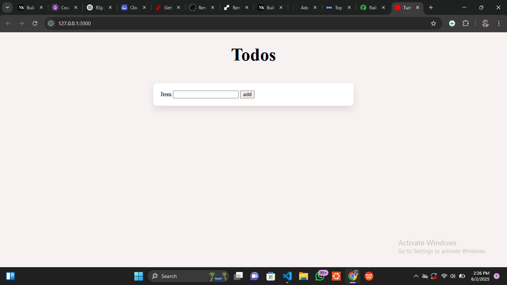
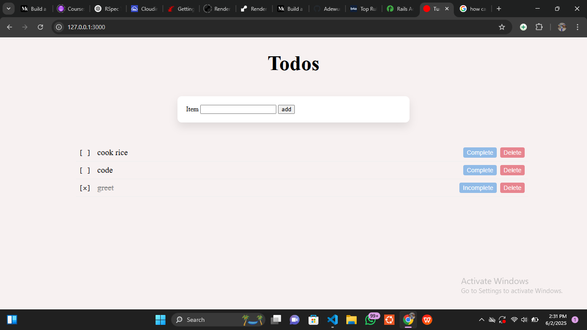
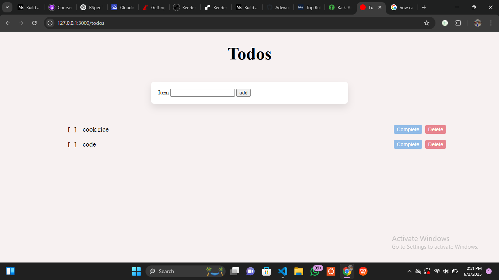

# README

 Ruby on Rails Project:
 # ✅ Todo with Turbo

A **real-time Todo app** built with **Rails 8**, **Turbo Streams**, and **Hotwire**, inspired by [this tutorial](https://jaythree.medium.com/build-a-real-time-todo-list-with-rails-8-and-turbo-streams-4818faa28c4d). This app demonstrates how to use Turbo Streams to dynamically update a list of tasks without any frontend JavaScript.

Live updates happen **automatically** across multiple sessions when new tasks are added, updated, or deleted — thanks to Turbo Streams and Turbo Frames.

---

## 📸 Screenshots

### 🏠 Homepage (Add Todo)

### 📝 Completed Todo

### ✅ Deleted a Todo


## Built With

- Ruby
- Rails 8
- RSpec
- Postgres

---

## ✨ Features

- 📄 Create, update, and delete todo items
- ⚡ Real-time UI updates using Turbo Streams
- ✅ Mark todos as `complete` or `incomplete`
- 🧪 RSpec test suite with controller and system tests
- 🎨 Clean and minimal layout using Rails built-in views
- 🚀 Rails 8, Turbo, and Importmaps (no Webpacker)

---

## 🛠 Tech Stack

- Ruby on Rails 8
- Turbo (Hotwire)
- Stimulus (optional controller for form reset)
- PostgreSQL
- RSpec + Capybara for testing

---

## 📦 Installation

1. **Clone the repository**
   ```bash
   git clone https://github.com/Adewunmi97/Todo_with_turbo.git
   cd Todo_with_turbo
Install dependencies: bundle install

Set up the database: bin/rails db:setup

Start the Rails server: bin/dev
(Make sure you have foreman installed if using Procfile.dev.)

Open the app in your browser: http://localhost:3000

🧪 Running Tests
This app uses RSpec for unit, controller, and system tests.
To run the test suite: bundle exec rspec
Make sure your test database is set up: RAILS_ENV=test bin/rails db:create db:migrate

🔄 Live Turbo Stream Updates
Turbo Streams automatically broadcasts changes to todos via ActionCable. You can open the app in two tabs and observe:
- Adding a todo updates both tabs in real time
- Marking a task as complete/incomplete updates instantly
- Deleting a todo removes it from all clients
This is possible without writing any custom JavaScript — thanks to Turbo!


🚧 Future Improvements
- Add due dates or priority
- User authentication with Devise
- Drag-and-drop to reorder tasks
- Filters for all, complete, incomplete

👤 Author
Adewunmi A.
📫 @Adewunmi97


## Video Presentation

[Loom Link](https://www.loom.com/share/97bbca025dba42bb97db73fce492abfb?sid=d79610ac-3142-416f-ba21-d97dbf61a673)

## Show your support

Give a ⭐️ if you like this project!

## Acknowledgments

- Juwon Oluwadare
- Project idea by [J3 on Medium](https://jaythree.medium.com/build-a-real-time-todo-list-with-rails-8-and-turbo-streams-4818faa28c4d)